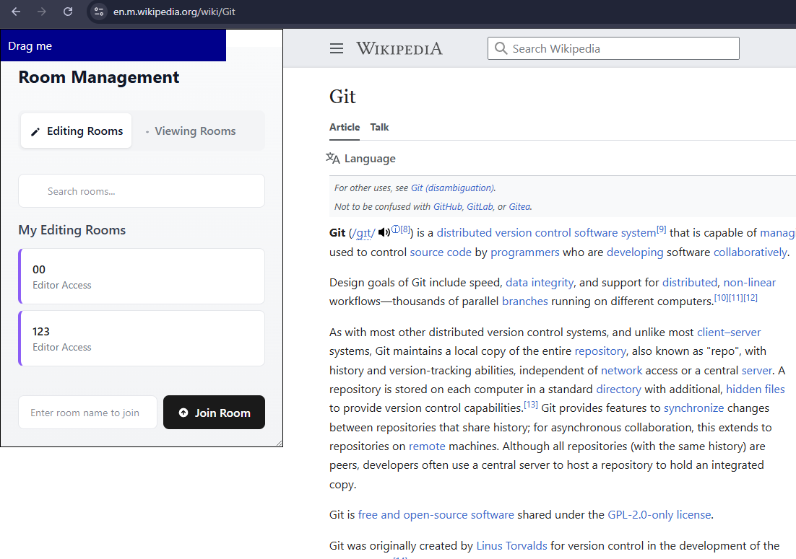
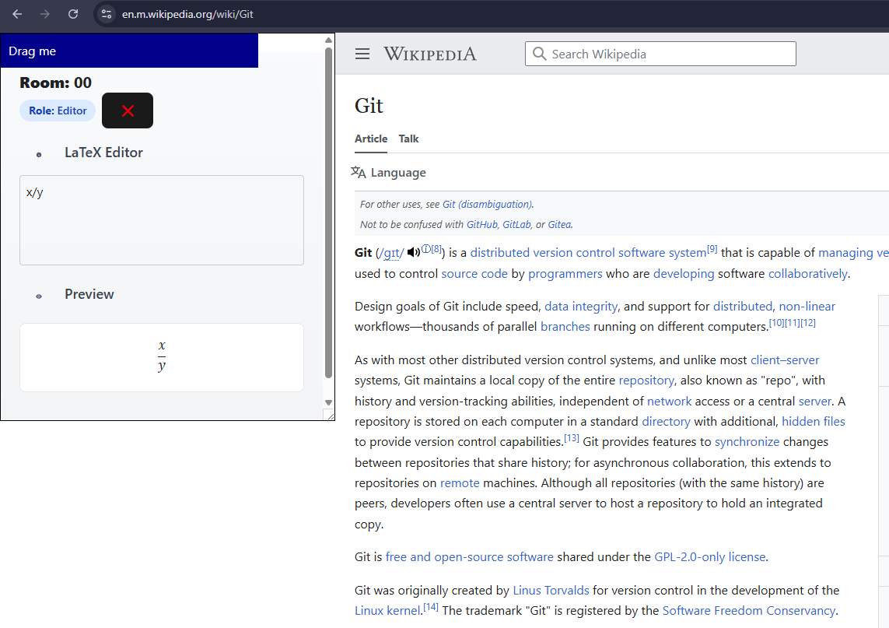

# Vatex Chrome Extension

This is the Chrome extension version of the Vatex application, providing voice-to-LaTeX functionality directly in your browser.

## Pictures





## Features

- Voice to LaTeX conversion
- Real-time collaborative editing
- In-browser LaTeX preview
- Seamless integration with any webpage

## Installation

1. Install dependencies:

```bash
npm install --force
```

2. Build the extension:

```bash
npm run build
```

3. Load the extension in Chrome:
   - Open Chrome and navigate to `chrome://extensions/`
   - Enable "Developer mode" in the top right
   - Click "Load unpacked"
   - Select the `dist` directory from this project

## Development

The extension is built using React and communicates with the Vatex backend server for real-time collaboration and LaTeX conversion.

## Note

Make sure the Vatex backend server is running before using the extension
